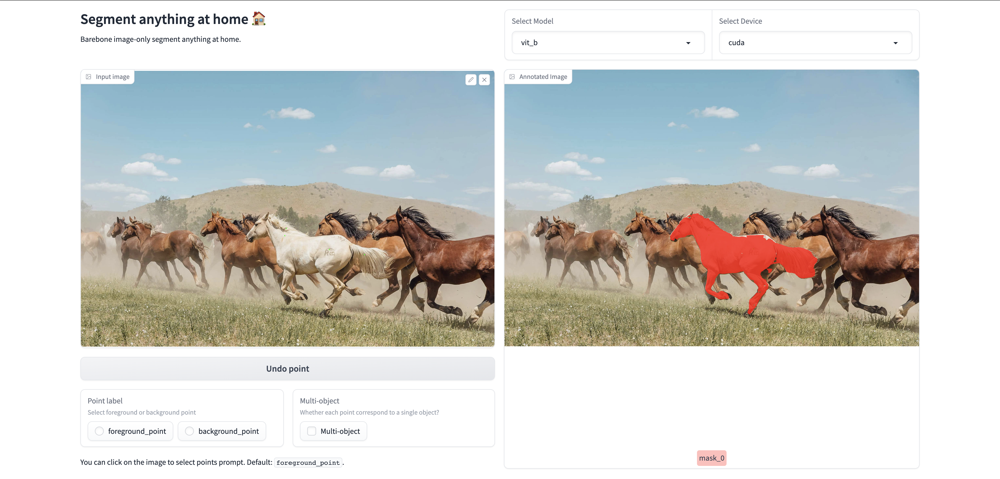

# Segment Anything at Home

This project is fork of  **[Segment Anything Model](https://segment-anything.com/)** by Meta. The UI is based on [Gradio](https://gradio.app/). 

- Try deme on HF: [AIBoy1993/segment_anything_webui](https://huggingface.co/spaces/AIBoy1993/segment_anything_webui)
- [GitHub](https://github.com/5663015/segment_anything_webui)



## Changes from the original version

- **No bells and whistles**: this version is stripped from video segmentation
  and text prompt segmentation. Focusing only on click-based interactive
  segmentation.
- **Performance improvements**: faster use of SAM predictor using these tricks:
  - The model is loaded only ONCE per session reducing unnecessary I/O (this
    reduces annotation latency by ~2x.)
  - SAM embeddings are calculated only ONCE per image (this reduces annotation
    latency by ~10x.)
- **Cleaner codebase**: the codebase is simplified and cleaned up. The codebase
  is also made more modular and easier to understand.

## Usage

Following usage is running on your computer. 

- Install Segment Anything（[more details about install Segment Anything](https://github.com/facebookresearch/segment-anything#installation):
  ```console
  $ pip install git+https://github.com/facebookresearch/segment-anything.git
  ```
- `git clone` this repository：
  ```console
  $ git clone https://github.com/imadtoubal/sam-home.git
  $ cd sam-home
  ```

- Make a new folder named `checkpoints` under this project，and put the downloaded weights files in `checkpoints`。You can download the weights using following URLs：

  - `vit_h`: [ViT-H SAM model](https://dl.fbaipublicfiles.com/segment_anything/sam_vit_h_4b8939.pth)
  - `vit_l`: [ViT-L SAM model](https://dl.fbaipublicfiles.com/segment_anything/sam_vit_l_0b3195.pth)
  - `vit_b`: [ViT-B SAM model](https://dl.fbaipublicfiles.com/segment_anything/sam_vit_b_01ec64.pth)

- Under `checkpoints`, make a new folder named `models--google--owlvit-base-patch32`, and put the downloaded [OWL-ViT weights](https://huggingface.co/google/owlvit-base-patch32) files in `models--google--owlvit-base-patch32`. 
- Run：
  ```
  python app.py
  ```

**Note：** Default model is `vit_b`，the demo can run on CPU. Default device is `cpu`。


## Reference

- Original repository: [Segment Anything WebUI](https://github.com/5663015/segment_anything_webui)
- Thanks to the wonderful work [Segment Anything](https://segment-anything.com/) and [OWL-ViT](https://arxiv.org/abs/2205.06230)

